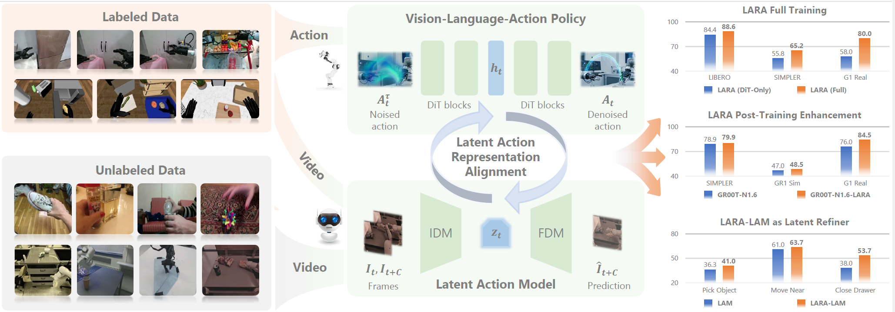

<div align="center">

<h1>LARA: Latent Action Representation Alignment for Vision-Language-Action Models</h1>

<p><strong>ICML 2026</strong></p>

<p>
Mengya Liu<sup>*1</sup>, Baoxiong Jia<sup>*1</sup>,
Jiangyong Huang<sup>1,2</sup>, Jingze Zhang<sup>1,2</sup>,
Siyuan Huang<sup>1,3</sup>
</p>

<p>
<sup>1</sup>State Key Laboratory of General Artificial Intelligence, BIGAI<br>
<sup>2</sup>Peking University &nbsp; <sup>3</sup>Delta Intelligence<br>
<sup>*</sup>Equal contribution
</p>

<p>
<a href="https://lmy1001.github.io/ICML26_LARA/"></a>
<a href="https://arxiv.org/pdf/2606.07100"></a>
<a href="https://huggingface.co/MengyaLiu/LARA_full/tree/main"></a>
</p>



</div>

## Introduction

This release provides two complementary implementations of **Latent Action
Representation Alignment (LARA)**. LARA jointly aligns a latent action model
with a vision-language-action policy, allowing latent visual dynamics to
regularize policy learning while action trajectories refine the learned latent
action representation.

- **[LARA_full](LARA_full/README.md)** is the reference implementation of the
  complete LARA training pipeline. It includes latent motion tokenizer
  pre-training, joint LARA pre-training with a GR00T N1.5 VLA backbone and a
  DiT action head, downstream post-training, and LIBERO-10 evaluation.
- **[LARA_posttrain_openpi](LARA_posttrain_openpi/README.md)** demonstrates
  LARA as a plug-and-play post-training module for an existing pretrained VLA
  model. It integrates latent motion supervision into OpenPI's pretrained
  π0.5 model and provides a LIBERO post-training and evaluation example.

The two subdirectories are independently installable and use their own
environments. Run commands from inside the selected subdirectory and follow
its README for model, dataset, and evaluation configuration.

## Repository Overview

| Directory | Purpose | Main training entry points |
| --- | --- | --- |
| [`LARA_full/`](LARA_full/README.md) | Full LARA training with the GR00T N1.5 backbone | `run_tokenizer.sh`, `run_lara_full_pretrain.sh`, `run_libero_10.sh` |
| [`LARA_posttrain_openpi/`](LARA_posttrain_openpi/README.md) | Plug-and-play LARA post-training for pretrained OpenPI π0.5 | `run_pi05_lara_libero.sh` |

The Chinese [release cleanup log](code_clean.log) records the code-cleaning
decisions, final bug fixes, verification results, and remaining author checks.

## Citation

If you find LARA useful in your research, please cite our paper:

```bibtex
@article{liu2026lara,
  title={Lara: Latent action representation alignment for vision-language-action models},
  author={Liu, Mengya and Jia, Baoxiong and Huang, Jiangyong and Zhang, Jingze and Huang, Siyuan},
  journal={arXiv preprint arXiv:2606.07100},
  year={2026}
}
```

## Acknowledgements

This release builds on
[Moto / Moto-GPT](https://github.com/TencentARC/Moto),
[NVIDIA Isaac-GR00T](https://github.com/NVIDIA/Isaac-GR00T), and
[Physical Intelligence's OpenPI](https://github.com/Physical-Intelligence/openpi).
LIBERO is used for downstream post-training and evaluation. See each
subdirectory's README and third-party notices for detailed attribution and
license information.

## License

Each subdirectory contains its own license and third-party notices. Model
weights and datasets may be subject to additional terms.
